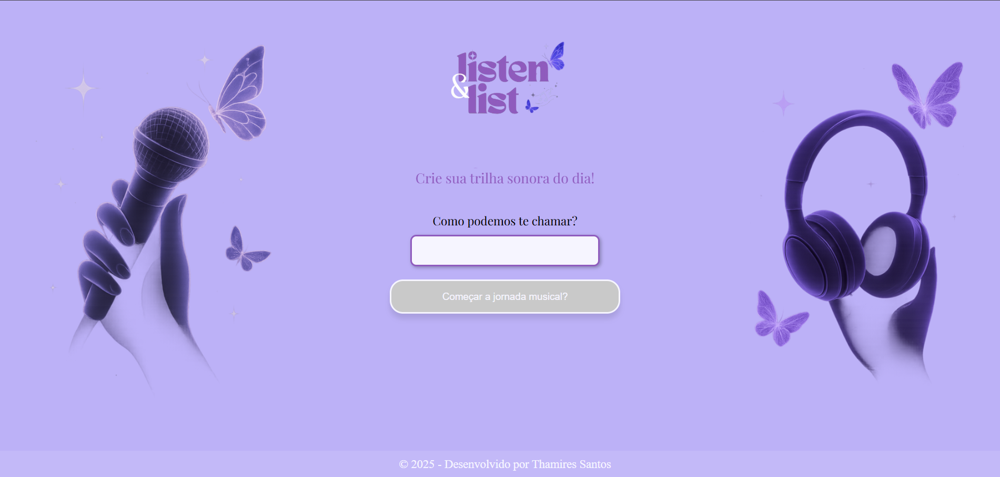
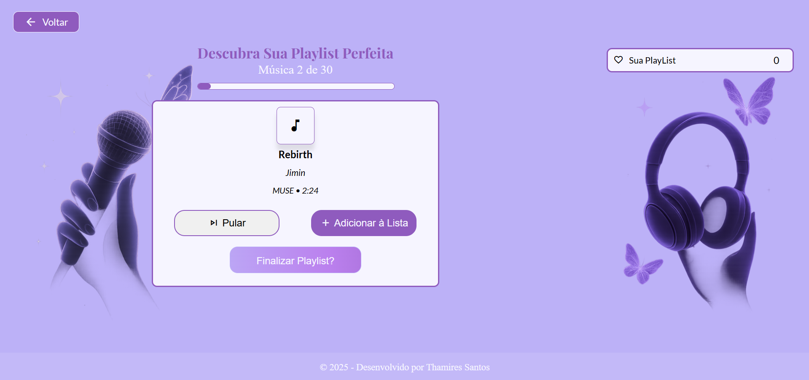
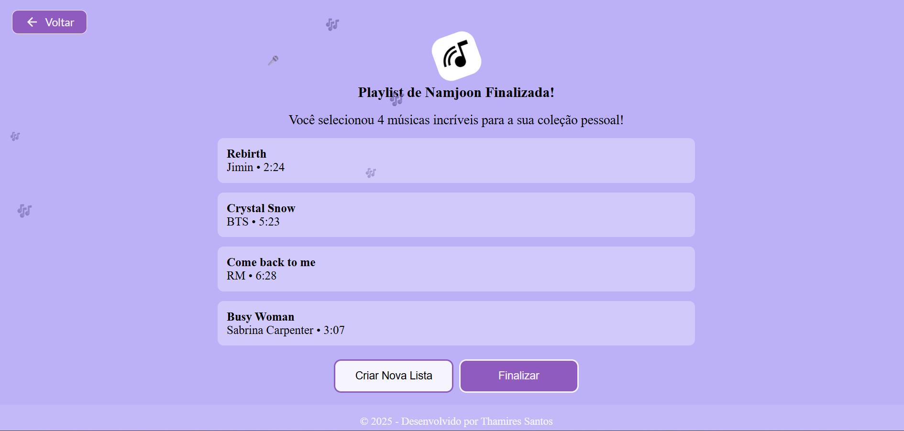

# 🎵 Listen and List  
Crie e organize sua própria playlist de forma simples e intuitiva!

---

## **Acesse o Projeto**
👉 **[Clique aqui para usar o Listen and List](https://thamiresantos.github.io/listen-and-list/)**

---

## **Índice**

- [Sobre o Projeto](#sobre-o-projeto)  
- [Tecnologias Utilizadas](#tecnologias-utilizadas)  
- [Funcionalidades](#funcionalidades)  
- [Como Usar](#como-usar)  
- [Screenshots](#screenshots)  
- [Contato](#contato)

---

## **Sobre o Projeto**

O **Listen and List** é um site onde o usuário pode criar sua própria playlist, adicionando músicas manualmente e organizando tudo do seu jeito.  

O objetivo do projeto foi treinar a construção de um fluxo entre páginas, prática de **JavaScript**, manipulação do **DOM**, validação de dados e criação de uma experiência clara e fluida para o usuário.

Trabalhei especialmente em:  
- como armazenar informações temporárias durante a navegação,  
- manipulação de listas e interações,  
- responsividade para mobile e desktop,  
- e um visual simples e direto.

---

## **Tecnologias Utilizadas**

- **HTML5** — estrutura das páginas  
- **CSS3** — estilo e responsividade  
- **JavaScript** — lógica da playlist, interações e navegação entre telas  

---

## **Funcionalidades**

- **Adicionar músicas** à playlist  
- **Remover músicas** individualmente  
- **Exibição da playlist final** em uma terceira tela  
- **Fluxo de navegação** entre as páginas  
- **Armazenamento temporário** das músicas durante a sessão  
- **Design responsivo**  

---

## **Como Usar**

1. Acesse o link do projeto.  
2. Siga as telas para criar sua playlist.  
3. Adicione as músicas que desejar.  
4. Confirme para visualizar o resultado final.  

Não é preciso instalação — basta abrir no navegador.

---

## **Screenshots**

### 📌 Tela Inicial  

---

### 🎧 Tela de Criação da Playlist  

---

### ✅ Tela Final  

---

### Contato
* [Github](https://github.com/thamiresantos)
* [Instagram](https://www.instagram.com/codewiththa/)
* [Linkedin](https://www.linkedin.com/in/thamires-santos-a9a652263) 

---
### © 2025 -Este projeto foi desenvolvido por Thamires Santos. 🌷
